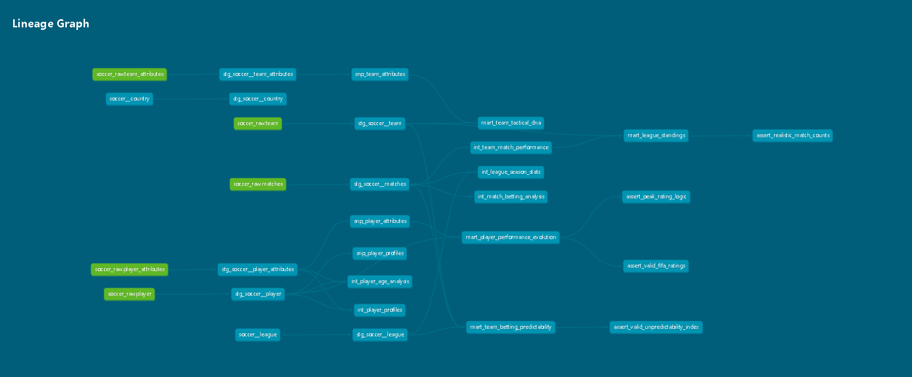
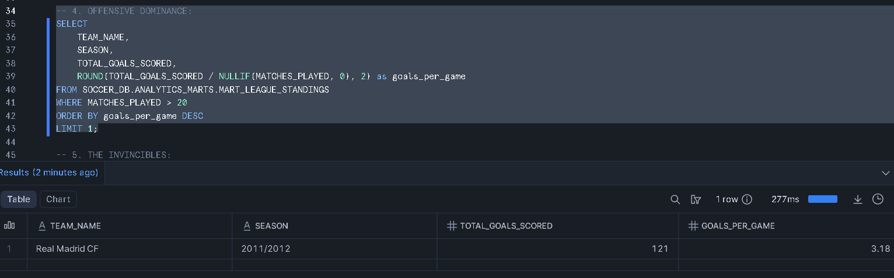
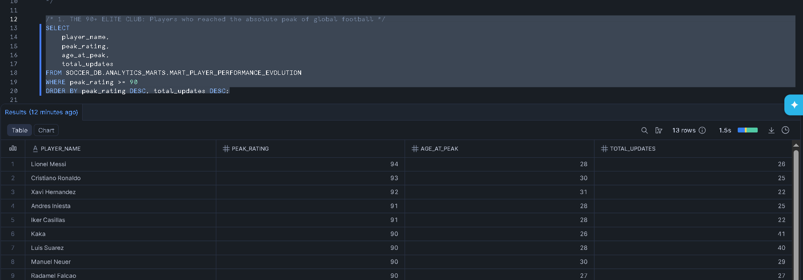

# ⚽ European Soccer Analytics - Modern Data Stack (MDS) Pipeline

[](https://www.getdbt.com/)
[](https://www.snowflake.com/)
[](https://en.wikipedia.org/wiki/SQL)

## 📌 Project Overview & Audience

This project is an end-to-end Analytics Engineering pipeline built to transform raw European soccer data into business-ready, high-performance analytical models.

**🎯 Target Audience:** Designed to empower **Business Intelligence (BI) Analysts** with pre-aggregated, granular dashboards, and **Data Scientists (ML Engineers)** with point-in-time exact feature engineering for predictability models.

---

## 📦 Dataset & Project Scale

The pipeline processes the renowned [Kaggle European Soccer Database](https://www.kaggle.com/datasets/hugomathien/soccer), ingested into Snowflake.

- **Scale:** +25,000 matches, +10,000 players, 11 major European Leagues
- **Timeline:** Covers 8 consecutive seasons of historical data
- **Infrastructure:** 7 Staging Views, 2 SCD Type 2 Snapshots, 4 Ephemeral Intermediate Models, and 4 Materialized Data Marts
- **Quality Assurance:** 70+ automated dbt data tests (including composite keys and accepted values)

---

## 🏗️ Architecture & Data Lineage

The project strictly follows a multi-layered, modular architecture based on Modern Data Stack principles, highlighting point-in-time historical tracking via Snapshots.



---

## 💡 Key Business Insights Delivered

By querying the finalized Data Marts (`mart_`), the pipeline uncovered several compelling, data-driven historical insights:

* **The Ultimate Legend (SCD Type 2 Proof):** Utilizing historical snapshotting to track attribute changes over time, the model identified **Luis Alberto** as the player who maintained his absolute peak physical rating for the longest duration—staying at his prime for an astonishing **214.2 months**.
* **Data-Driven Peak Age:** Statistical aggregation of historical player lifecycles reveals that a European soccer player hits their absolute statistical prime (Peak Rating) at the exact average age of **26.1 years**, with the highest individual rating ever recorded in the dataset reaching **94**.
* **The "Giant Killer" Index:** By algorithmically comparing bookmaker odds against actual match outcomes, the unpredictability model mathematically proved that the **Scotland Premier League** is the most volatile and unpredictable league, with favorites failing to win at a significantly higher rate (**Index Score: 3681.36**) than top-tier leagues.
* **Offensive Dominance:** Analyzing historical league standings shows that **Real Madrid CF (2011/2012 Season)** stands as the most lethal attacking side in modern history, averaging a staggering **3.18 goals per game**.
* **The Invincibles (Peak Win Rate):** The pipeline identified the **2010/2011 FC Porto** squad as the most dominant single-season team, achieving a monumental **90.0% Win Rate** across their entire domestic campaign.

---

## 📊 Sample Query Output

> **Evidence of Production-Ready Models:** These are real results queried directly from the finalized `mart_` models in Snowflake, confirming the accuracy of the pipeline's logic.

### ⚽ Team Performance Analytics (Offensive Dominance)
Verification of the 3.18 goals-per-game record:



### 📈 Player Evolution (SCD Type 2 History)
Verification of player peak tracking and longitudinal data:



---

## 🚀 Key Engineering Highlights

### 1. Slowly Changing Dimensions (SCD Type 2)

Implemented dbt `snapshots` using hybrid `timestamp` and `check` strategies to track historical changes in player physical attributes and team tactical metrics — enabling true point-in-time analysis without data loss.

### 2. DRY Principles with Modular Jinja Macros

Abstracted complex, repetitive business logic (betting upset identification, tactical threshold categorizations) into reusable **Jinja Macros** (`is_favorite_upset`, `classify_tactical_score`). Ensures a Single Source of Truth — if business definitions change, logic is updated in one place and propagates automatically.

### 3. Advanced Window Functions & CTE Stacking

- Solved SQL nested window function limitations (e.g., pinpointing the exact date of a career peak) via logical CTE stacking
- Utilized `RANK() OVER (PARTITION BY ...)` for dynamic league standings based on strict European tie-breaking rules (Points → Goal Difference → Goals Scored)

### 4. Rigorous Data Quality & Governance

- 70+ dbt tests covering `not_null`, `unique`, `accepted_values`, and composite key uniqueness
- Used `dbt_utils.unique_combination_of_columns` to eliminate fan-out risk on unpivoted datasets
- Static mapping tables (Countries, Leagues) migrated into version-controlled, testable **dbt Seeds**

---

## ⚙️ Quick Start & Setup

**1. Clone the repository:**

```bash
git clone https://github.com/your-username/soccer-dbt-pipeline.git
cd soccer-dbt-pipeline
```

**2. Configure your `profiles.yml`:**

Add the following to `~/.dbt/profiles.yml`, replacing placeholders with your Snowflake credentials:

```yaml
soccer_analytics:
  target: dev
  outputs:
    dev:
      type: snowflake
      account: <your_account_id>
      user: <your_username>
      password: <your_password>
      role: SYSADMIN
      database: SOCCER_DB
      warehouse: COMPUTE_WH
      schema: MARTS
      threads: 4
```

**3. Install dependencies and run the pipeline:**

```bash
dbt deps      # Install dbt_utils
dbt seed      # Load static country/league mappings
dbt snapshot  # Capture initial historical states
dbt build     # Run all models and 70+ tests
```

**4. Explore the Data Dictionary:**

This project includes full column-level documentation and an interactive DAG (Directed Acyclic Graph):

```bash
dbt docs generate
dbt docs serve
```

Opens at `http://localhost:8080`.

---

## 📄 License

This project is licensed under the MIT License. See the `LICENSE` file for details.

## ✉️ Contact

**Onur Soylu** — Data / Analytics Engineer  
[LinkedIn Profile](https://www.linkedin.com/in/onur-soylu-0ba931119/) | [oonursoylu@gmail.com](mailto:oonursoylu@gmail.com)

*Feel free to reach out for feedback, questions, or collaboration!*
