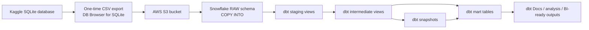
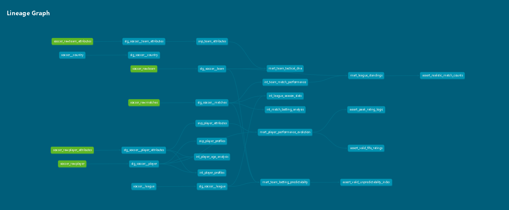
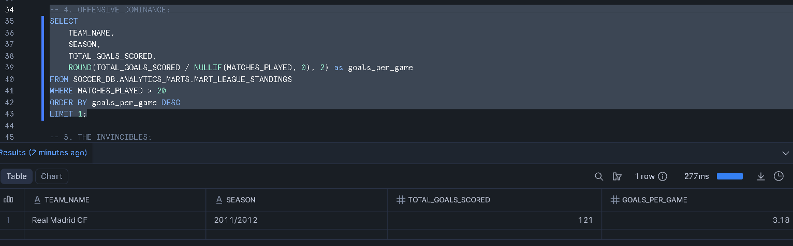
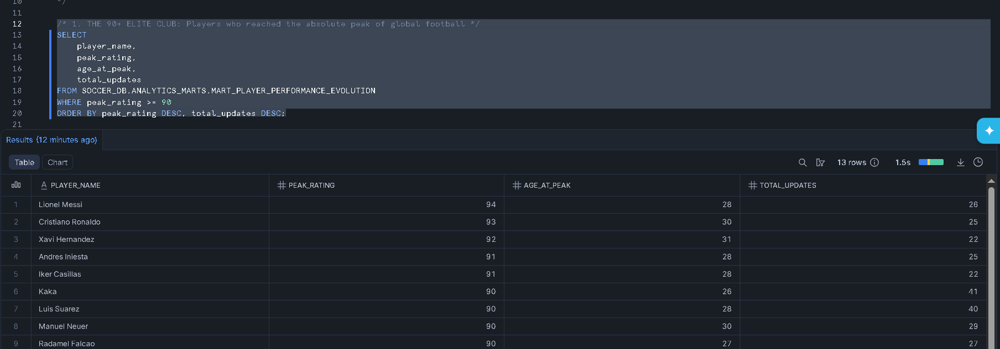

# Soccer Analytics Engineering Pipeline with dbt and Snowflake

[](https://www.getdbt.com/)
[](https://www.snowflake.com/)
[](https://aws.amazon.com/)
[](https://github.com/oonursoylu/soccer-dbt-snowflake-pipeline/actions)
[](https://github.com/oonursoylu/soccer-dbt-snowflake-pipeline)
[](https://oonursoylu.github.io/soccer-dbt-snowflake-pipeline/)

## Overview

This project is a portfolio analytics engineering pipeline built with **dbt Core, Snowflake, AWS S3, and GitHub Actions**.

It uses the public European Soccer Database from Kaggle. The goal is not to build a football app, but to show the kind of work an Analytics Engineer or Junior Data Engineer does in a modern warehouse project: load raw data, model it into clean analytical layers, test assumptions, document the logic, and publish useful marts for analysis.

The original Kaggle data is provided as a SQLite database. I exported the SQLite tables to CSV files as a one-time bootstrap step using DB Browser for SQLite, uploaded those files to S3, loaded them into a Snowflake RAW schema with `COPY INTO`, and then transformed the data with dbt.

## Project Highlights

- Snowflake database with RAW, staging, intermediate, snapshot, and mart layers
- 16 dbt models: 12 views and 4 materialized mart tables
- 3 dbt snapshots using the `check` strategy
- 101 dbt data tests, including custom singular tests
- 2 dbt seeds for small country and league reference tables
- 2 reusable Jinja macros for repeated business logic
- GitHub Actions workflow for `dbt build`
- Published dbt Docs site with model lineage and documentation

## Why I Built This

I built this project to practice practical analytics engineering skills:

- converting raw relational data into analytical models
- separating staging, intermediate, snapshot, and mart logic
- writing tests that catch real data quality issues
- using Snowflake as the warehouse layer
- documenting model grain, business logic, and assumptions
- validating dbt changes with CI

The dataset is football-related, but the engineering patterns are transferable to many business datasets.

## Tech Stack

| Area | Tool |
|---|---|
| Data warehouse | Snowflake |
| Transformation | dbt Core |
| Cloud storage | AWS S3 |
| CI + docs publishing | GitHub Actions |
| Testing | dbt tests + dbt_utils |
| Documentation | dbt Docs |
| Source data | Kaggle European Soccer Database / SQLite |

## Dataset and Scale

The project uses the [European Soccer Database](https://www.kaggle.com/datasets/hugomathien/soccer) dataset.

| Metric | Value |
|---|---:|
| Matches | 25,000+ |
| Players | 10,000+ |
| Leagues | 11 |
| Seasons | 8 |
| Total ingested records | 220,000+ |
| dbt models | 16 |
| dbt snapshots | 3 |
| Materialized marts | 4 |
| dbt seeds | 2 |
| dbt sources | 5 |
| dbt data tests | 101 |
| Total nodes in latest `dbt build` | 122 |

Latest local validation:

```text
dbt build completed successfully
PASS=122 WARN=0 ERROR=0 SKIP=0 TOTAL=122
Runtime: 37.16s
dbt: 1.11.10
Snowflake adapter: 1.11.5
```

## Pipeline Architecture


```mermaid
flowchart LR
    A["Kaggle SQLite database"] --> B["One-time CSV export<br/>DB Browser for SQLite"]
    B --> C["AWS S3 bucket"]
    C --> D["Snowflake RAW schema<br/>COPY INTO"]
    D --> E["dbt staging views"]
    E --> F["dbt intermediate views"]
    F --> G["dbt snapshots"]
    F --> H["dbt mart tables"]
    G --> H
    H --> I["dbt Docs / analysis / BI-ready outputs"]
```



Live documentation:  
[dbt Docs](https://oonursoylu.github.io/soccer-dbt-snowflake-pipeline/)

## Final Data Marts

The project creates four analytics-ready mart models.

| Mart | Grain | Purpose |
|---|---|---|
| `mart_league_standings` | One row per team, league, and season | Calculates league table metrics such as points, wins, losses, goals, and ranking |
| `mart_player_performance_evolution` | One row per player | Compares initial rating, peak rating, rating growth, and peak timing |
| `mart_team_betting_predictability` | One row per team, league, and season | Measures how often team results differed from bookmaker expectations |
| `mart_team_tactical_dna` | One row per team | Classifies team tactical style using historical team attribute scores |

These marts are easier to query than the raw normalized source tables and are designed for downstream analysis.

## Example Questions Answered

- Which teams had the strongest season-level performance?
- Which players improved the most between their first and peak rating?
- At what age did players in the dataset typically reach their peak rating?
- Which teams or leagues were less predictable relative to betting odds?
- Which teams show possession, counter-attacking, or high-pressing tactical profiles?
- Which source data issues need to be handled before analysis?

## Selected Results

### Player Performance Evolution

The player mart uses historical rating dates from the source attributes table to compare each player's first observed rating with their peak rating.

The model calculates peak rating, growth percentage, age at start, age at peak, and the duration of the peak rating period.

### Peak Player Age

Aggregating player lifecycle records shows that the average player in the dataset reaches peak rating at about **25.6 years old**.

### Match Predictability

The betting predictability mart compares Bet365 odds with actual match results. It separates full upsets from draw upsets so that unexpected draws do not get treated the same as outright underdog wins.

### Team Performance

The league standings mart calculates season-level metrics such as points, win rate, goal difference, ranking, and goals per game.

## Data Quality Example

During development, a dbt range test on `age_at_rating` failed for around 16,000 rows.

Those rows had the same rating date, `2007-02-22`, and produced unrealistic player ages of 8 or 9. This looked like a source-system default date rather than a transformation bug.

I handled this in the intermediate layer with a documented filter:

```sql
rating_date >= '2008-01-01'
```

The staging layer stays close to the raw source. The filter is applied only in the player age analysis model, where valid rating dates are required for meaningful age calculations.

This is the pattern I wanted to show: detect a data issue with a test, understand the business impact, and apply the rule at the narrowest layer where it is needed.

## Engineering Decisions

### 1. SQLite to Snowflake Loading

The Kaggle dataset starts as a SQLite database. I exported the source tables to CSV files as a one-time bootstrap step, uploaded them to AWS S3, and loaded them into Snowflake using an external stage and `COPY INTO`.

This created a separate RAW layer before any dbt transformations were executed.

### 2. Source Freshness

This dataset is historical and static, so daily source freshness is not expected. The `date` columns in the source tables represent match dates or rating dates, not ingestion timestamps.

For that reason, I did not add a dbt source freshness check. A freshness check would become meaningful only if the ingestion process added a field such as `_loaded_at` to the RAW tables.

### 3. dbt Snapshots

The source data already contains historical player and team attribute records. The dbt snapshots are used to demonstrate SCD Type 2 mechanics and to preserve row-level changes across repeated warehouse loads.

The snapshots use the `check` strategy because the source data does not provide a reliable `updated_at` column.

Snapshots are configured for:

- player ratings
- player physical profiles
- team tactical attributes

### 4. Reusable Jinja Macros

Two Jinja macros keep repeated logic consistent:

- `is_favorite_upset`: classifies a team's result relative to betting odds
- `classify_tactical_score`: groups tactical scores into High, Medium, or Low categories while keeping `NULL` values unchanged

This keeps repeated business logic in one place instead of duplicating the same `CASE` expressions across models.

### 5. SQL Modeling

The project uses CTEs, joins, aggregations, window functions, unpivot logic, and ranking logic.

For league standings, I used `RANK()` instead of `ROW_NUMBER()` because teams can share the same position when tied on points and tie-breakers.

```sql
RANK() OVER (
    PARTITION BY season, league_id
    ORDER BY total_points DESC, goal_difference DESC, total_goals_scored DESC
)
```

### 6. Data Quality Testing

The project includes 101 dbt tests. These include:

- `not_null`
- `unique`
- `accepted_values`
- `relationships`
- `dbt_utils.accepted_range`
- `dbt_utils.expression_is_true`
- custom singular tests

Examples of custom tests:

- no team should play more than 50 league matches in one season
- FIFA-style ratings should stay between 1 and 99
- total wins should equal total losses within each league season

These tests help catch duplicated rows, broken unpivot logic, invalid ratings, and inconsistent aggregate metrics.

### 7. CI and dbt Docs Publishing

A GitHub Actions workflow runs `dbt build` against a Snowflake CI schema on pull requests and pushes to `main`.

If a model or test fails, the workflow fails. On successful main-branch runs, the workflow regenerates and publishes the dbt Docs site.

## Sample Outputs

### Team Performance Mart



### Player Performance Evolution Mart



## Repository Structure

```text
.
|-- .github/workflows/       # GitHub Actions workflow for dbt CI and docs publishing
|-- analyses/                # SQL queries used for validation and exploration
|-- assets/                  # README images and sample query outputs
|-- infrastructure/          # Snowflake, AWS, and ingestion setup files
|-- macros/                  # Reusable dbt Jinja macros
|-- models/                  # dbt models
|   |-- staging/             # Source-level cleaning and standardization
|   |-- intermediate/        # Business logic and reusable transformations
|   `-- marts/               # Final analytics-ready mart models
|-- seeds/                   # Static mapping tables
|-- snapshots/               # dbt snapshots for SCD Type 2 examples
|-- tests/                   # Custom singular dbt tests
|-- dbt_project.yml          # Main dbt project configuration
|-- packages.yml             # dbt package dependencies
|-- package-lock.yml         # Locked dbt package versions
|-- .gitignore               # Ignored local/generated files
|-- LICENSE
`-- README.md
```

## How to Run the Project

### 1. Clone the repository

```bash
git clone https://github.com/oonursoylu/soccer-dbt-snowflake-pipeline.git
cd soccer-dbt-snowflake-pipeline
```

### 2. Configure dbt profile

Add this to `~/.dbt/profiles.yml` and replace the placeholders with your Snowflake account details.

```yaml
soccer_analytics:
  target: dev
  outputs:
    dev:
      type: snowflake
      account: <your_account_identifier>
      user: dbt_user
      password: "{{ env_var('DBT_PASSWORD') }}"
      role: TRANSFORM_ROLE
      database: SOCCER_DB
      warehouse: SOCCER_WH
      schema: dev_schema
      threads: 4
      client_session_keep_alive: false
```

Set the password as an environment variable before running dbt.

PowerShell:

```powershell
$env:DBT_PASSWORD = '<your_password>'
```

macOS/Linux:

```bash
export DBT_PASSWORD='<your_password>'
```

### 3. Install dependencies and run dbt

Before running dbt, the Snowflake database, warehouse, RAW schema, external stage, and source tables must be created and loaded using the SQL files in the `infrastructure/` folder. The dbt project assumes that the RAW tables already exist in Snowflake.

```bash
dbt deps
dbt build
```

`dbt build` runs the seeds, snapshots, models, and tests in dependency order.

### 4. Generate local docs

```bash
dbt docs generate
dbt docs serve
```

The docs will be available at:

```text
http://localhost:8080
```

## What This Project Shows

This project shows my ability to:

- build dbt models from raw source data
- design staging, intermediate, snapshot, and mart layers
- work with Snowflake and AWS S3
- write analytical SQL with CTEs, joins, window functions, and aggregations
- add automated data quality tests
- use dbt snapshots for SCD Type 2 modeling examples
- document models and columns with dbt Docs
- use GitHub Actions for basic CI validation
- explain data quality decisions instead of hiding source data problems

## Possible Next Improvements

- Add a small Airflow or Prefect project to orchestrate CSV upload, Snowflake load, and dbt build steps
- Add a reproducible SQLite-to-CSV export script to replace the one-time manual bootstrap step
- Add `_loaded_at` fields to RAW tables if ingestion becomes scheduled, then add source freshness checks
- Add a small Power BI dashboard on top of the marts
- Add an incremental model only if a future ingestion flow appends or updates source data regularly

## License

This project is licensed under the MIT License. See the `LICENSE` file for details.

## Contact

**Onur Soylu** - Data / Analytics Engineer

[LinkedIn Profile](https://www.linkedin.com/in/oonursoylu/) | [oonursoylu@gmail.com](mailto:oonursoylu@gmail.com)
