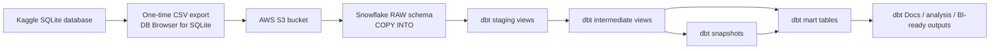
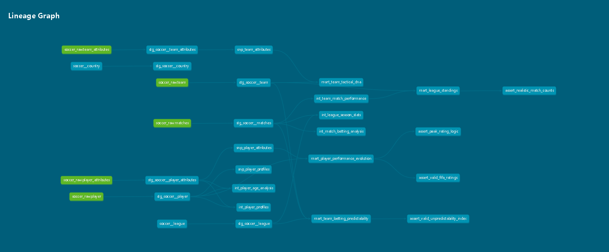
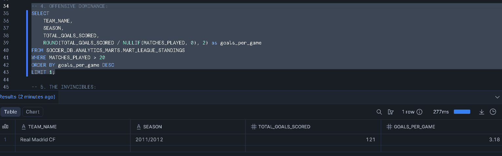
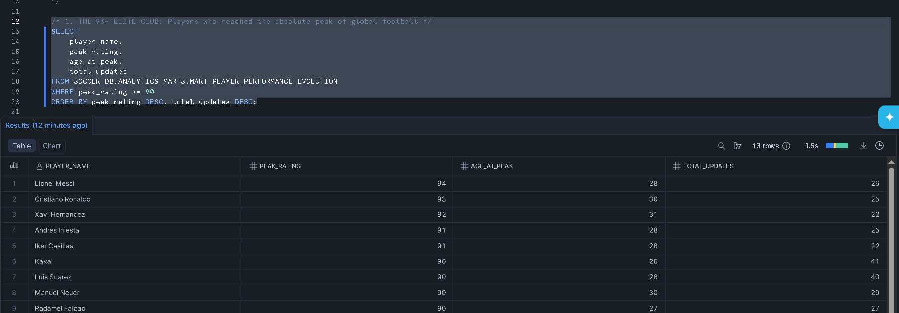

# Football analytics pipeline with dbt and Snowflake

[](https://www.getdbt.com/)
[](https://www.snowflake.com/)
[](https://aws.amazon.com/)
[](https://github.com/oonursoylu/soccer-dbt-snowflake-pipeline/actions)
[](https://github.com/oonursoylu/soccer-dbt-snowflake-pipeline)
[](https://oonursoylu.github.io/soccer-dbt-snowflake-pipeline/)

An analytics engineering project built with dbt Core, Snowflake, AWS S3 and GitHub Actions on the public [European Soccer Database](https://www.kaggle.com/datasets/hugomathien/soccer) from Kaggle.

Football is only the subject. The source is messy in the same ways business data is: normalised tables, historical attribute records and at least one suspicious default date. The work is the same too. Load the raw tables, model them in clear layers, test the assumptions, document the logic and publish marts that are easy to query.

The Kaggle data comes as a SQLite database. I exported its tables to CSV once with DB Browser for SQLite, uploaded the files to S3 and loaded them into a Snowflake RAW schema with `COPY INTO`. Everything after that happens in dbt.

## At a glance

- Snowflake layers for RAW, staging, intermediate, snapshots and marts
- 16 dbt models: 12 views and 4 mart tables
- 3 snapshots using the `check` strategy
- 101 data tests, including custom singular tests
- 2 seeds for small country and league reference tables
- 2 Jinja macros for logic shared between models
- A GitHub Actions workflow that runs `dbt build` and publishes the dbt Docs site

## Tech stack

| Area | Tool |
|---|---|
| Data warehouse | Snowflake |
| Transformation | dbt Core |
| Cloud storage | AWS S3 |
| CI and docs publishing | GitHub Actions |
| Testing | dbt tests and dbt_utils |
| Documentation | dbt Docs |
| Source data | Kaggle European Soccer Database (SQLite) |

## Dataset and scale

| Metric | Value |
|---|---:|
| Matches | 25,000+ |
| Players | 10,000+ |
| Leagues | 11 |
| Seasons | 8 |
| Total ingested records | 220,000+ |
| dbt models | 16 |
| dbt snapshots | 3 |
| Materialised marts | 4 |
| dbt seeds | 2 |
| dbt sources | 5 |
| dbt data tests | 101 |
| Nodes in the latest `dbt build` | 122 |

Latest local run:

```text
dbt build completed successfully
PASS=122 WARN=0 ERROR=0 SKIP=0 TOTAL=122
Runtime: 37.16s
dbt: 1.11.10
Snowflake adapter: 1.11.5
```

## Pipeline


```mermaid
flowchart LR
    A["Kaggle SQLite database"] --> B["One-time CSV export<br/>DB Browser for SQLite"]
    B --> C["AWS S3 bucket"]
    C --> D["Snowflake RAW schema<br/>COPY INTO"]
    D --> E["dbt staging views"]
    E --> F["dbt intermediate views"]
    F --> G["dbt snapshots"]
    F --> H["dbt mart tables"]
    G --> H
    H --> I["dbt Docs / analysis / BI-ready outputs"]
```



The generated documentation is published at [oonursoylu.github.io/soccer-dbt-snowflake-pipeline](https://oonursoylu.github.io/soccer-dbt-snowflake-pipeline/).

## Marts

| Mart | Grain | What it holds |
|---|---|---|
| `mart_league_standings` | One row per team, league and season | League table metrics: points, wins, losses, goals and rank |
| `mart_player_performance_evolution` | One row per player | First rating, peak rating, growth and when the peak came |
| `mart_team_betting_predictability` | One row per team, league and season | How often results differed from bookmaker expectations |
| `mart_team_tactical_dna` | One row per team | Tactical style classified from historical team attribute scores |

They are much easier to query than the normalised source tables. Some of the questions they answer:

- Which teams had the strongest seasons?
- Which players improved most between their first and peak rating, and at what age did they peak?
- Which teams or leagues were least predictable relative to betting odds?
- Which teams show a possession, counter-attacking or high-pressing profile?
- Which source data problems need handling before analysis?

## A few results

The player mart compares each player's first observed rating with their peak and calculates growth, age at start, age at peak and how long the peak lasted. Across the dataset, players reach their peak rating at about **25.6 years old** on average.

The betting mart compares Bet365 odds with actual results. It keeps full upsets and draw upsets apart, so an unexpected draw is not treated like an underdog win.

The standings mart calculates season-level points, win rate, goal difference, rank and goals per game.

## Data quality example

While I was building the player age model, a dbt range test on `age_at_rating` failed for about 16,000 rows. They all shared the same rating date, 22 February 2007, and gave players ages of 8 or 9. That pattern points to a default date in the source system, not a bug in the transformation.

I kept the staging layer close to the raw source and added a documented filter only in the model that calculates ages:

```sql
rating_date >= '2008-01-01'
```

This is the habit I wanted to practise: let a test surface the problem, work out what it affects, and fix it in the narrowest place that needs it.

## Engineering decisions

### Loading

The source starts as SQLite. After the one-time CSV export, the files go to S3 and then into Snowflake through an external stage and `COPY INTO`, so a separate RAW layer exists before dbt touches anything.

### No source freshness check

The dataset is historical and static, and its `date` columns hold match or rating dates, not load timestamps. A freshness check only becomes meaningful once ingestion adds a field such as `_loaded_at` to the RAW tables.

### Snapshots

The source already contains historical player and team attributes. The snapshots are there to show SCD Type 2 mechanics and to keep row-level changes across repeated loads. They use the `check` strategy because the source has no reliable `updated_at` column, and they cover player ratings, player physical profiles and team tactical attributes.

### Macros

`is_favorite_upset` classifies a team's result against the betting odds. `classify_tactical_score` groups tactical scores into High, Medium and Low and leaves `NULL` values as they are. Each rule lives in one place instead of being copied into several `CASE` expressions.

### SQL

The models use CTEs, joins, aggregations, window functions, unpivoting and ranking. League standings use `RANK()` rather than `ROW_NUMBER()`, because teams tied on points and tie-breakers should share a position:

```sql
RANK() OVER (
    PARTITION BY season, league_id
    ORDER BY total_points DESC, goal_difference DESC, total_goals_scored DESC
)
```

### Tests

The 101 tests use `not_null`, `unique`, `accepted_values`, `relationships`, `dbt_utils.accepted_range`, `dbt_utils.expression_is_true` and custom singular tests. A few of the custom ones: no team plays more than 50 league matches in a season, FIFA-style ratings stay between 1 and 99, and total wins equal total losses within each league season. Between them they catch duplicated rows, broken unpivot logic, invalid ratings and aggregates that do not add up.

### CI and docs

A GitHub Actions workflow runs `dbt build` against a Snowflake CI schema on pull requests and on pushes to `main`. If a model or test fails, the workflow fails. Successful runs on `main` regenerate and publish the dbt Docs site.

## Sample outputs

### League standings mart



### Player performance evolution mart



## Repository structure

```text
.
|-- .github/workflows/       # GitHub Actions workflow for dbt CI and docs publishing
|-- analyses/                # SQL queries used for validation and exploration
|-- assets/                  # README images and sample query outputs
|-- infrastructure/          # Snowflake, AWS and ingestion setup files
|-- macros/                  # Reusable dbt Jinja macros
|-- models/                  # dbt models
|   |-- staging/             # Source-level cleaning and standardisation
|   |-- intermediate/        # Business logic and reusable transformations
|   `-- marts/               # Final analytics-ready mart models
|-- seeds/                   # Static mapping tables
|-- snapshots/               # dbt snapshots for SCD Type 2 examples
|-- tests/                   # Custom singular dbt tests
|-- dbt_project.yml          # Main dbt project configuration
|-- packages.yml             # dbt package dependencies
|-- package-lock.yml         # Locked dbt package versions
|-- .gitignore               # Ignored local and generated files
|-- LICENSE
`-- README.md
```

## How to run it

### 1. Clone the repository

```bash
git clone https://github.com/oonursoylu/soccer-dbt-snowflake-pipeline.git
cd soccer-dbt-snowflake-pipeline
```

### 2. Configure the dbt profile

Add this to `~/.dbt/profiles.yml` and replace the placeholders with your Snowflake details.

```yaml
soccer_analytics:
  target: dev
  outputs:
    dev:
      type: snowflake
      account: <your_account_identifier>
      user: dbt_user
      password: "{{ env_var('DBT_PASSWORD') }}"
      role: TRANSFORM_ROLE
      database: SOCCER_DB
      warehouse: SOCCER_WH
      schema: dev_schema
      threads: 4
      client_session_keep_alive: false
```

Set the password as an environment variable before running dbt.

PowerShell:

```powershell
$env:DBT_PASSWORD = '<your_password>'
```

macOS/Linux:

```bash
export DBT_PASSWORD='<your_password>'
```

### 3. Install dependencies and run dbt

First create the Snowflake database, warehouse, RAW schema, external stage and source tables with the SQL files in `infrastructure/`. The dbt project expects the RAW tables to exist already.

```bash
dbt deps
dbt build
```

`dbt build` runs the seeds, snapshots, models and tests in dependency order.

### 4. Generate the docs locally

```bash
dbt docs generate
dbt docs serve
```

The docs open at `http://localhost:8080`.

## What I would add next

- A script for the SQLite-to-CSV export, replacing the manual one-time step
- `_loaded_at` fields in the RAW tables and a source freshness check, if ingestion ever runs on a schedule
- Orchestration with Airflow or Prefect for the upload, load and build steps
- Incremental models, but only if new source data starts arriving regularly

## Licence

MIT. See [LICENSE](LICENSE).

## Contact

Onur Soylu · [LinkedIn](https://www.linkedin.com/in/oonursoylu/) · [oonursoylu@gmail.com](mailto:oonursoylu@gmail.com)
